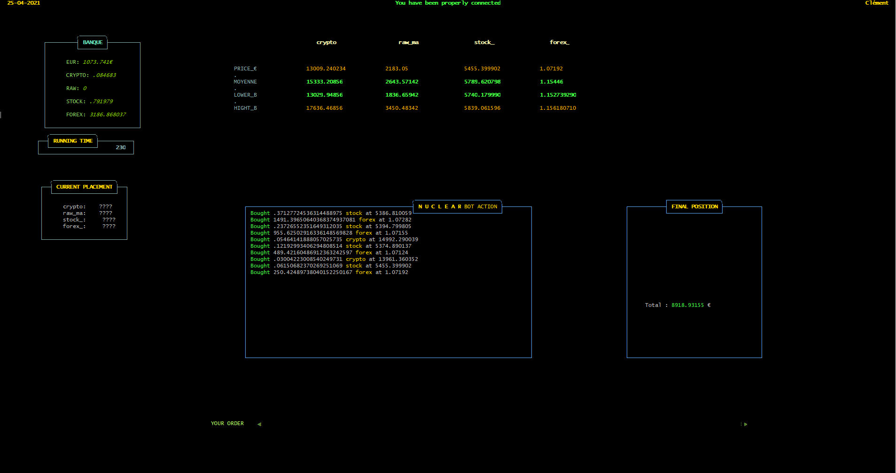
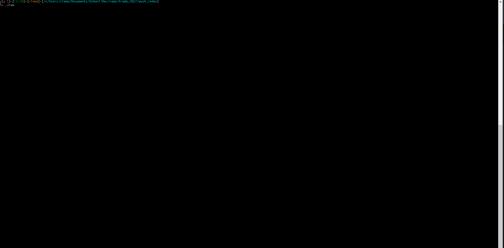

<h1 align="center">

  <br>

  
  <br>
    <b><i>N U C L E A R</i></b> - BOT
  <br>
</h1>

<h4 align="center">Trading bot with UI in bash</h4>

<div align="center"><sub>This is a school project made in 2017 during my 3rd school year</sub></div>
<div align="center"><sub> Version <a href="#">unreleased</a></sub></div>

<br>

<div align="center">

<!-- TOC -->
<p align="center">
  <a href="#demo">Demo</a> •
  <a href="#run">Run</a> •
  <a href="#edit">Edit</a>
</p>

<!-- omit in toc -->
## 

</div>


## Demo



## Run

```
$ git clone git@github.com:ClementRoyer/trading.git
$ cd trading

------ Option One ------
- Run with custom file -
$ cd push_index
$ ./run

------ Option Two ------
- Run with online data -
$ cd trade_online
$ ./command.sh

```

## Edit

You can edit the file `command.sh` in root folder, `push_index/run` will use this file to start.
<!-- footer -->

<!-- omit in toc -->
#

<div align="center"> 
  <sub>Built with ❤︎ by
  <a href="https://www.linkedin.com/in/cl%C3%A9ment-royer/">Clément ROYER</a>
<br><br>

[][Policy]  [][twitter] [][Linkedin] [][website] 
</div>

<!-- omit in toc -->
# 


<!-- links -->
[Main-Readme]: .
[Policy]: ./LICENSE
[Postman-Doc]: .
[ChangeLog]: ./changelog
[Twitter]: https://www.twitter.com/ciemrnt
[Linkedin]: https://www.linkedin.com/in/cl%C3%A9ment-royer/
[website]: http://clement.royer.gg/en/
